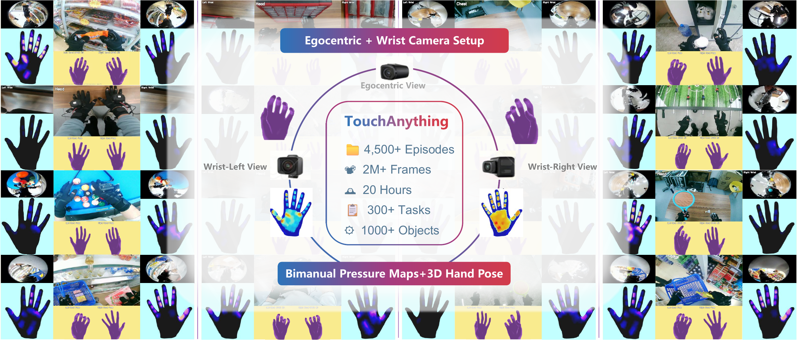

# About Me

Here is **Ziteng Gao** (Michael, 高紫腾). 

I am currently a first-year Ph.D. student at Harbin Institute of Technology Shenzhen(HITSZ), majored in computer science, where I am fortunate to be supervised by [Prof. Shuo Yang](https://shuoyang-1998.github.io/).

Before joining HITSZ, I was a MLE at XPENG Motors, focused on end-to-end autonomous driving algorithms, including imitation learning, reinforcement learning, for pretrain, SFT, and RLFT. More prior, I got my MS degree in Mechanical Engineering from National University of Singapore(NUS), and received my B.Eng. degree in Mechatronics from Harbin Institute of Technology(HIT).

I am always open to academic discussions and potential collaborations. Please feel free to reach out to me at **e1010863 [at] u.nus.edu**

**updated: Mar. 2026**

  
  
  
  
  
  

## Research Interests
- Embodied AI, Autonomous Driving
- VLA, Reinforcement Learning, Imitation Learning
- Locomotion and Manipulation, End-to-end Planning

## News
- **Mar. 2026**: Excited to start my Ph.D. journey at Harbin Institute of Technology, Shenzhen(HITSZ).

- **Feb. 2026**: I have just ended my 2 years MLE journey at XPeng Motors, an amazing and fruitful experience.

## Publications

Research Project

[TouchAnything: A Dataset and Framework for Bimanual Tactile Estimation from Egocentric Video](https://jianyi2004.github.io/TouchAnything-Website/)

Jianyi Zhou, **Ziteng Gao**, Feiyang Hong, Zirui Liu, Guannan Zhang, Weisheng Dai, Ruichen Zhen, Chuqiao Lyu, Haotian Wu, Yinian Mao, Xushi Wang, Yuxiang Jiang, Shuo Yang

*Harbin Institute of Technology, Shenzhen; Meituan Academy of Robotics*

[**Project Page**](https://jianyi2004.github.io/TouchAnything-Website/)
- The first large-scale multi-view tactile dataset for egocentric hand-object interaction with bimanual 3D hand pose annotations and dense continuous pressure maps.

## Experience
### Career
**[Xpeng Moters](https://www.xpeng.com/?fromNav=1https://www.xpeng.com/?fromNav=1)** | Guangzhou, China, Dec 2023 - Feb 2026
  >Full-time Autonomous Driving Algorithm Engineer (MLE), Autonomous Driving Center  
  Design and optimize Xplanner (XPENG Motor's self-developed end-to-end model for massive production) 
  IL-Pretrain, SFT, RLFT 

**[Starj.ai](https://starjourneyai.com/pages/EN_shouye/EN_shouye.html)** | Guangzhou, China, Sep 2023 - Dec 2023
  > Intern, Planning Algorithm Engineer 
  
### Education
#### **Harbin Institute of Technology, Shenzhen (HITSZ)** | Shenzhen, China, Mar 2026 - Current
  > Ph.D. student, iLearn-Lab, Computer Science

#### **National University of Singapore (NUS)** | Singapore, Jul 2022 - Sep 2023
  > MS Mechanical Engineering

#### **Harbin Institute of Technology (HIT)** | Harbin, China, Aug 2018 - Jun 2022
  >B.Eng. Mechatronic Engineering 
  NUS (Suzhou) Research Institute (NUSRI) | Collaboration by NUS and HIT | Suzhou, China, Sep 2021 - Jun 2022 
  University of Pennsylvania (UPenn) | Exchange Student | Philadelphia, USA, Jan 2019 - Feb 2019

## Chat with me (TODO)

[//]: # (**Dec 2025:** I have set up the [online-coffee-time]&#40;https://calendly.com/lancecai/meet-with-lance&#41; &#40;Inspired by [Hanlin Cai]&#40;https://caihanlin.com/&#41;&#41;. Feel free to reach out!)

[//]: # ()
[//]: # (<!-- Calendly inline widget begin -->)

[//]: # ()
[//]: # (

)

[//]: # ()

[//]: # (<!-- Calendly inline widget end -->)
